# Drake

This repository is part of my class project (Bipedal Walking Robots - EEE 6734) at Intelligent Systems and Robotics department in UWF. 

Model-Based Design and Verification for Robotics.

Please see the [Drake Documentation](https://drake.mit.edu) for more
information.

## Installation
This installation instruction was tested on ubuntu 20.04.
```
mkdir ~/drake_from_source
cd ~/drake_from_source
python3 -m venv drake_from_source_venv
source drake_from_source_venv/bin/activate
git clone --filter=blob:none https://github.com/RobotLocomotion/drake.git
sudo ./setup/ubuntu/install_prereqs.sh
```
For python bindings, you have to install some dependencies.
```
ln -s /usr/bin/python3-config ~/drake_from_source/drake_from_source_venv/bin/python3-config
ln -s /usr/include/python3.8 ~/drake_from_source/drake_from_source_venv/include/python3.8
# you can also directly copy the python3.8 from the /usr/include directory to ~/drake_from_source/drake_from_source_venv/include directory.
pip3 install PyYAML
pip3 install numpy
pip3 install matplotlib
```
Now, build the repo.
```
mkdir drake-build
cd drake-build
cmake ../drake
make -j
```
For source installation, follow the instruction from this [page](https://drake.mit.edu/from_source.html).

For binary installation, follow the instruction from this [page](https://drake.mit.edu/pip.html#stable-releases).

For tutorial, follow the instruction from this [page](https://github.com/RobotLocomotion/drake/blob/master/tutorials/README.md).

## Bipedal Walking Robots
### 1st Assignment
Design a dynamic Simulation of the Rimless Wheel to develop phase portraits of the dynamics. Submit plots of the phase portraits as they vary from different slopes. Plot how the limit cycles of these phase portraits vary when contacts occur at different times. Explain how these elements relate to the physical parameters of the rimless wheel.

### Answer:
A rimless wheel acts as a passive dynamic walker. 

<p align="center">
  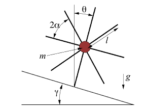
</p>

#### Physical Parameters
m = 1 kg, l = 1 m, g = 9.8 ms-2, no. of spokes is 8, α = π/8 = 22.5 degrees, initial angle = Theta
#### Initial Velocity, Thetadot = 1.1 rad/s
#### Slope, 𝜸 = 0.0 radian


##### Phase diagram:

<p align="center">
  
</p>

<p style="font-size: small;">
    The phase portrait for a rimless wheel on a level surface (slope of 0.0 radians) showcases a distinct dynamic pattern, illustrated by the blue lines which represent the trajectory of the wheel's angular velocity (`thetadot`) against its angular position (`theta`). The star marker indicates the initial condition from which the wheel's motion is simulated. Notably, the trajectories converge into a horizontal band, indicating that, irrespective of the starting angular velocity, the system stabilizes to a steady-state motion with minimal fluctuation in `thetadot`. The lack of a slope means there is no gravitational contribution to the wheel's potential energy, leading to a motion primarily governed by the initial kinetic energy and dissipation due to the ground contact. The uniformity of the gray energy contour lines suggests that energy dissipation is consistent across collisions, which is expected in the absence of a slope. This behavior is indicative of the natural tendency of the rimless wheel to reach a constant rolling speed on a flat surface, highlighting the inherent stability of the system under such conditions.
</p>

#### Slope, 𝜸 = 0.07 radian


##### Phase diagram:

<p align="center">
  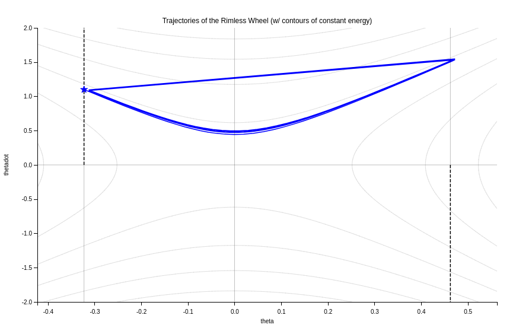
</p>

<p style="font-size: small;">
    In the phase portrait on a gentle slope of 0.07 radian, the blue lines indicating the wheel's trajectory suggest a smooth transition in angular velocity (`thetadot`) with respect to angular position (`theta`). The initial condition, marked by a star, denotes the starting point for the simulation, from which the wheel progresses into steady oscillatory motion. The paths traced by the wheel form elongated loops, which align with the gradual energy contours shown in gray, illustrating the conservative nature of the system's dynamics on such a mild slope. These contours represent levels of mechanical energy, which remain nearly constant, implying minimal energy loss during the wheel's rolling motion. The slight divergence of the trajectories as they approach the edges indicates the influence of the slope on the wheel's dynamics, subtly altering the energy conservation compared to a level surface. Despite the incline, the system appears to maintain a consistent pattern of motion, underscoring the efficiency and stability of the rimless wheel even on slightly inclined planes.
</p>

#### Slope, 𝜸 = 0.08 radian


##### Phase diagram:

<p align="center">
  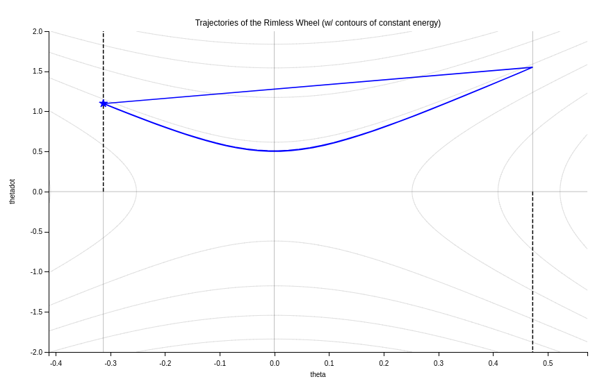
</p>

<p style="font-size: small;">
    This plot shows a series of trajectories indicating the system's behavior over time. The distinct blue lines represent the path the wheel takes as it moves forward, with the star marking the starting point at a particular angle and angular velocity. The convergence of these lines towards a cyclical pattern suggests the system settles into a stable rhythmic motion, characterizing the natural dynamics of a passive dynamic walker. The grey lines depict contours of constant energy, reflecting the conservation of mechanical energy in the absence of external forces, except at the moments of impact with the slope, where energy can be dissipated. This plot emphasizes the passive stability of the rimless wheel, as it relies on the slope-induced potential energy to maintain its motion, ultimately achieving a steady-state gait solely through its mechanical design and gravitational pull.
</p>
 
#### Slope, 𝜸 = 0.09 radian


##### Phase diagram:

<p align="center">
  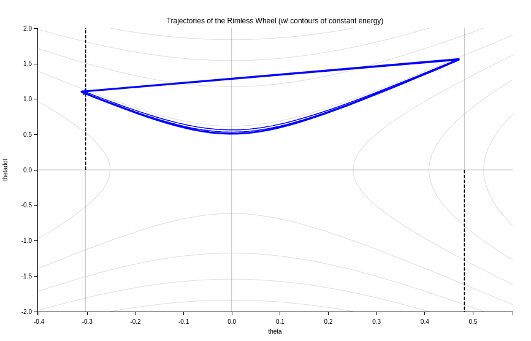
</p>

<p style="font-size: small;">
    The blue lines indicate the wheel's trajectories, which demonstrate how the system evolves from an initial state (marked by the star) towards a regular, repeating motion, characteristic of a stable limit cycle. The convergence of these paths suggests that the wheel is capable of self-stabilizing after some initial oscillations. The gray lines depict the energy contours, within which the system's state oscillates due to its conservation of energy between collisions. As the trajectories don't cross these contours, they illustrate the periodic nature of the motion, where kinetic energy is traded for potential energy and vice versa, as the wheel rolls down the inclined plane. This behavior highlights the intrinsic stability and efficiency of passive dynamic walkers, which utilize gravity to maintain momentum without external actuation.
</p>

#### Slope, 𝜸 = 0.1 radian


##### Phase diagram:

<p align="center">
  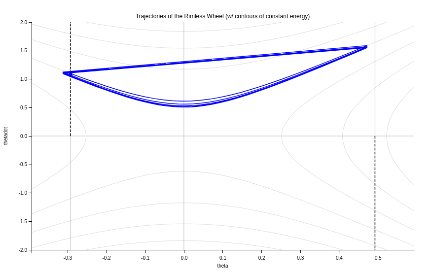
</p>

<p style="font-size: small;">
    The plot's blue lines show the wheel's motion trajectories, converging to a stable limit cycle, indicative of a consistent and sustainable rolling motion down the slope. The initial state, marked by a star, begins with a certain angular position and velocity, and rapidly converges to this limit cycle. The gray lines represent contours of constant energy, illustrating the conservation of mechanical energy between the discrete collision events at the dashed vertical lines. This plot effectively captures the essence of passive dynamic walkers, which exploit gravitational forces on sloped terrain to sustain their motion, demonstrating the potential for both stability and energy efficiency in such systems.
</p>

#### Slope, 𝜸 = 0.5 radian


##### Phase diagram:

<p align="center">
  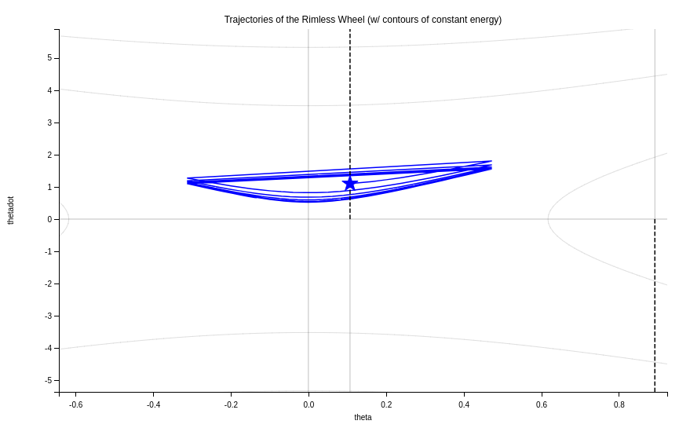
</p>

<p style="font-size: small;">
    The phase portrait on a relatively steep slope of 0.5 radians illustrates a more pronounced dynamic behavior. The trajectories, depicted in blue, show significant oscillations in angular velocity (`thetadot`) for a given range of angular positions (`theta`). The convergence of these trajectories towards a looping pattern suggests the rimless wheel's tendency to stabilize into a rhythmic motion, despite the increased potential for instability due to the steeper slope. The initial condition, marked by a star, indicates a starting point from which the system quickly transitions into the stable limit cycle. The gray curves show energy levels that are no longer conserved through collisions due to the larger loss of energy upon impact at this steeper angle, which is characteristic of higher slopes that induce greater instability and energy changes in passive dynamic walkers. The plot emphasizes the challenge of maintaining a stable gait on steeper slopes and the sophisticated dynamics that govern the motion of such systems.
</p>

#### Slope, 𝜸 = 1.0 radian


##### Phase diagram:

<p align="center">
  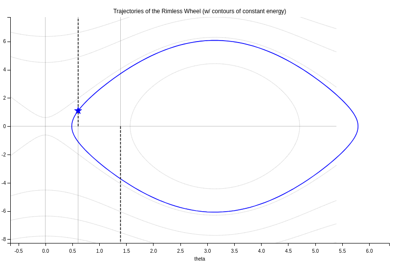
</p>

<p style="font-size: small;">
    The phase portrait on a slope with an angle of 1 radian in blue trajectory represents the evolution of the system's angular position (theta) and angular velocity (thetadot) over time. The initial condition, marked by a star, depicts the starting point of the simulation from which the system evolves. This trajectory encircles a region of phase space, suggesting that the rimless wheel enters a periodic motion or limit cycle, a consistent pattern of behavior that repeats after each complete revolution. The gray lines represent contours of constant mechanical energy, providing a reference for the wheel's potential and kinetic energy states. On such a slope, the impact of the wheel with the ground leads to a loss of energy, and the dynamics of the system are characterized by these collisions that cause transitions between energy states. The overall shape of the trajectory indicates that the system reaches a steady-state behavior fairly quickly, following a predictable path despite the relatively steep slope, which is indicative of the wheel's ability to adapt to this specific incline and maintain a stable cycle of motion.
</p>

#### Slope, 𝜸 = 3.0 radian


##### Phase diagram:

<p align="center">
  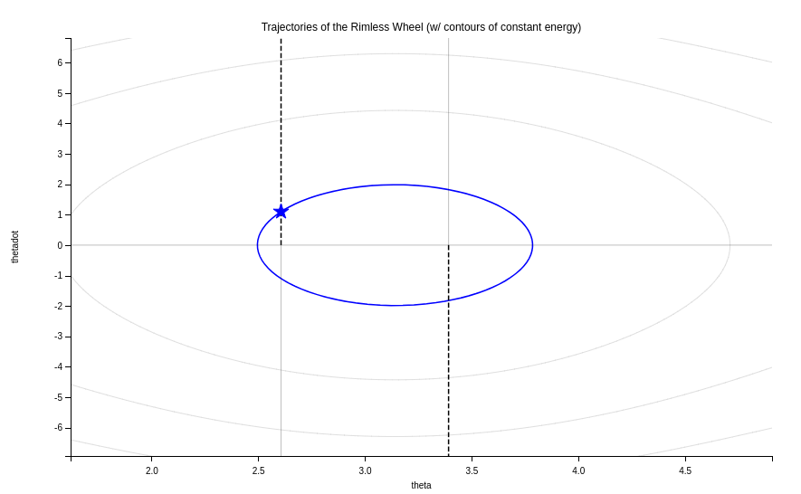
</p>

<p style="font-size: small;">
    The phase portrait on a slope with an inclination of 3.0 radians with blue trajectory forms a horizontal ellipse, indicative of a stable oscillatory pattern that represents the wheel's motion as it navigates the slope. The star marks the initial condition of the system where the wheel begins its journey with a certain angular velocity and position. The energy contours in grey suggest that the wheel's motion is consistent with the conservation of energy, with no significant peaks or troughs, demonstrating a steady rhythmic progression. This is characteristic of a system where kinetic and potential energies are traded back and forth smoothly, without external inputs or losses, such as friction or air resistance, influencing the motion.
</p>

#### Slope, 𝜸 = 6.0 radian


##### Phase diagram:

<p align="center">
  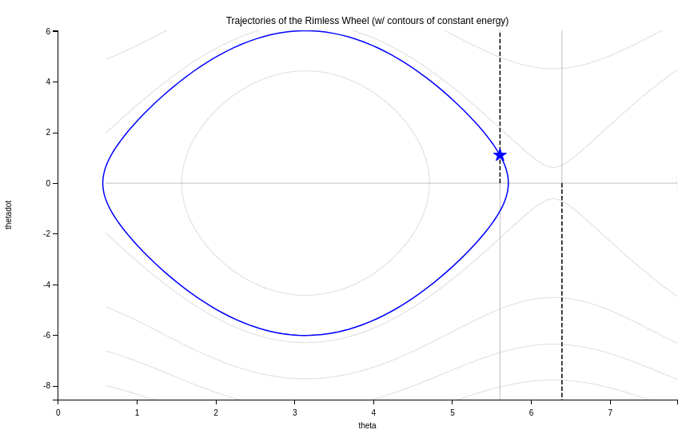
</p>

<p style="font-size: small;">
    The phase portrait on a slope with an inclination of 6.0 radians with the elliptical blue trajectory showcases the angular position (`theta`) and angular velocity (`thetadot`) of the wheel, forming a closed loop that signifies a periodic motion, indicative of the wheel continually rolling down the slope without interruption. The star marker signifies the initial state of the system, which in this case to be at the apex of the loop, suggesting a high angular velocity at a particular angular position. Despite the steep slope, the wheel's motion is regular and predictable, with the extremes of the ellipse indicating moments of directional change and energy peaks, underscoring the dynamical equilibrium maintained between the gravitational pull and the wheel's geometry. The grey contour lines represent different energy levels, with the trajectory intersecting these lines at points of equal energy, illustrating the conservation of mechanical energy as the wheel rolls down the slope. This type of motion is characteristic of a pendulum-like system where kinetic and potential energy are exchanged seamlessly within the confines of the system's constraints.
</p>

#### Slope, 𝜸 = 6.2 radian


##### Phase diagram:

<p align="center">
  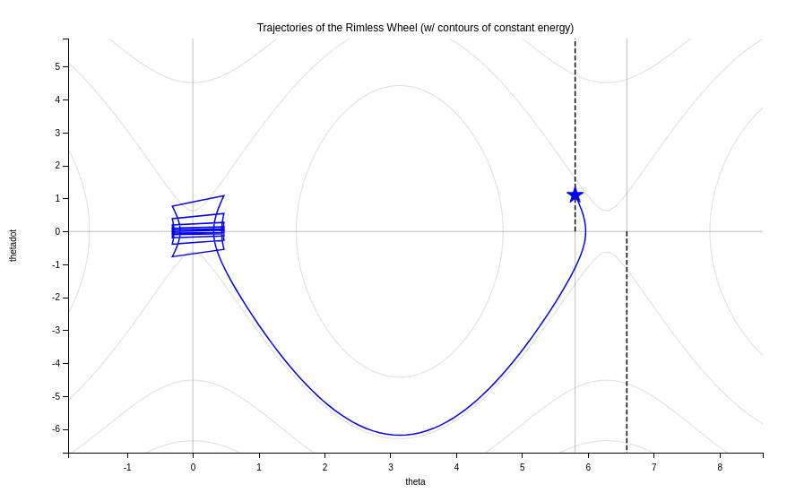
</p>

<p style="font-size: small;">
    In the phase portrait navigating a 6.2-radian slope, the trajectory, highlighted in blue, captures the wheel's angular velocity (`thetadot`) in relation to its angular position (`theta`). The plot features a distinctive loop to the left, indicating a rapid change in the wheel's motion—possibly an abrupt stop and reverse due to the wheel striking the slope. This could suggest a collision or a moment where kinetic energy is momentarily conserved before being redistributed as the wheel continues its journey. The trajectory stretches smoothly to the right, where a star marks a significant point, likely the initial condition. The looping lines near the start point could represent transient dynamics as the wheel settles into a steady-state behavior after the initial perturbation. The grey lines demarcate constant energy levels, serving as a backdrop that underscores the natural energy conversion cycles of the system—kinetic to potential energy and back—as the wheel rolls over the terrain, influenced by gravitational forces. This portrayal of the wheel's dynamics illustrates the interplay between inertia, gravity, and the geometric constraints imposed by the slope.
</p>

#### Slope, 𝜸 = 6.3 radian


##### Phase diagram:

<p align="center">
  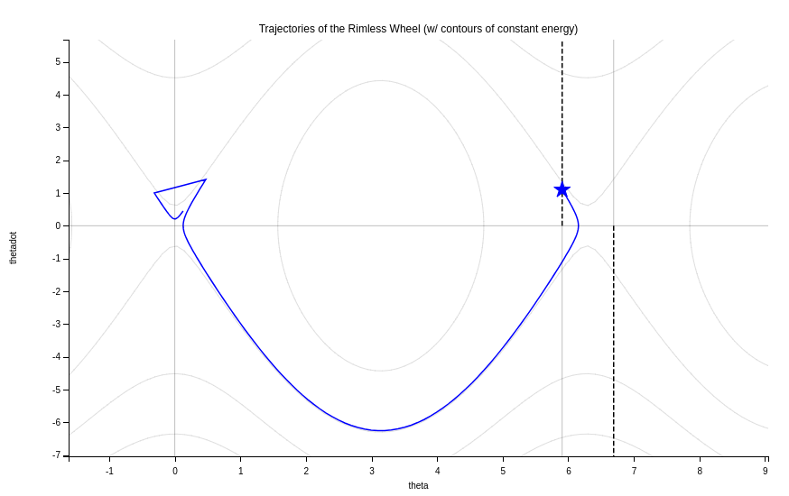
</p>

<p style="font-size: small;">
    The provided phase portrait on a slope of 6.3 radians showcases a trajectory that reflects significant dynamic fluctuations in angular velocity (`thetadot`) as the wheel traverses angular position (`theta`). The trajectory, marked in blue, begins at a point denoted by a star, likely representing the starting condition with a certain initial angular velocity. The pronounced loop near the left side of the plot indicates a rapid deceleration and reversal of direction as the wheel ascends the slope after a descent, which could be due to an impactful collision with the ground as it rolls over the slope's peak. This feature of the plot suggests the wheel experiences a sharp increase in kinetic energy as it goes downhill, followed by a significant loss of that energy as it moves uphill against gravity. The rest of the trajectory smoothly transitions towards a lower angular velocity as the wheel ascends the slope on the right, before reaching another collision point, completing the cycle of motion. The gray lines represent contours of constant mechanical energy, signifying potential trajectories the wheel could follow if it were not for the dissipative forces at play, illustrating the conservation of energy within this dynamic system.
</p>

#### Slope, 𝜸 = 7.0 radian

##### Phase diagram:


<p align="center">
  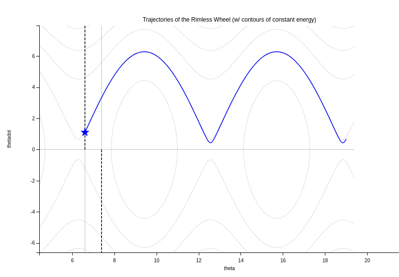
</p>

<p style="font-size: small;">
    The phase portrait on a 7.0-radian slope reveals a highly dynamic system, where the blue trajectory depicting angular velocity (`thetadot`) against angular position (`theta`) shows multiple oscillations indicative of rapid accelerations and decelerations. Starting from the initial condition marked by a star, the wheel experiences a significant conversion of gravitational potential into kinetic energy as it descends the slope, followed by energy loss as it climbs, creating a wave-like pattern. The nearly vertical sections of the trajectory suggest the impact points of the wheel's legs with the ground, leading to abrupt changes in motion. The gray contour lines represent constant energy levels, enclosing the trajectory and indicating a potential perpetual motion if external forces were absent. This complex behavior underscores the influence of gravity on the wheel's stability and the challenges it faces in maintaining a predictable path on such steep inclines.
</p>


