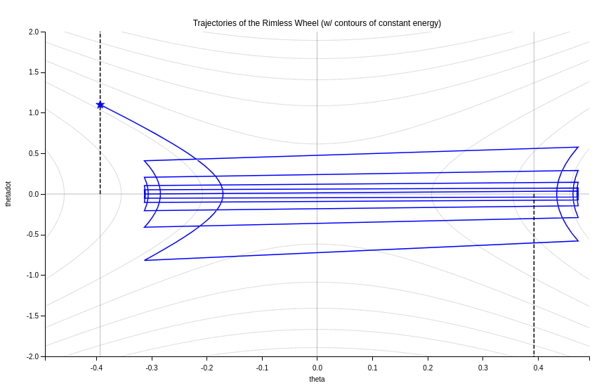

# Drake

This repository is part of my class project (Bipedal Walking Robots - EEE 6734) at Intelligent Systems and Robotics department in UWF. 

Model-Based Design and Verification for Robotics.

Please see the [Drake Documentation](https://drake.mit.edu) for more
information.

## Installation
This installation instruction was tested on ubuntu 20.04.
```
mkdir ~/drake_from_source
cd ~/drake_from_source
python3 -m venv drake_from_source_venv
source drake_from_source_venv/bin/activate
git clone --filter=blob:none https://github.com/RobotLocomotion/drake.git
sudo ./setup/ubuntu/install_prereqs.sh
```
For python bindings, you have to install some dependencies.
```
ln -s /usr/bin/python3-config ~/drake_from_source/drake_from_source_venv/bin/python3-config
ln -s /usr/include/python3.8 ~/drake_from_source/drake_from_source_venv/include/python3.8
# you can also directly copy the python3.8 from the /usr/include directory to ~/drake_from_source/drake_from_source_venv/include directory.
pip3 install PyYAML
pip3 install numpy
pip3 install matplotlib
```
Now, build the repo.
```
mkdir drake-build
cd drake-build
cmake ../drake
make -j
```
For source installation, follow the instruction from this [page](https://drake.mit.edu/from_source.html).

For binary installation, follow the instruction from this [page](https://drake.mit.edu/pip.html#stable-releases).

For tutorial, follow the instruction from this [page](https://github.com/RobotLocomotion/drake/blob/master/tutorials/README.md).

## Bipedal Walking Robots
### 1st Assignment
Design a dynamic Simulation of the Rimless Wheel to develop phase portraits of the dynamics. Submit plots of the phase portraits as they vary from different slopes. Plot how the limit cycles of these phase portraits vary when contacts occur at different times. Explain how these elements relate to the physical parameters of the rimless wheel.

### Answer:
A rimless wheel acts as a passive dynamic walker.
#### Slope, 𝜸 = 0.0


##### Phase diagram:

<p align="center">
  
</p>

<p style="font-size: small;">
    The phase portrait for a rimless wheel on a level surface (slope of 0.0 radians) showcases a distinct dynamic pattern, illustrated by the blue lines which represent the trajectory of the wheel's angular velocity (`thetadot`) against its angular position (`theta`). The star marker indicates the initial condition from which the wheel's motion is simulated. Notably, the trajectories converge into a horizontal band, indicating that, irrespective of the starting angular velocity, the system stabilizes to a steady-state motion with minimal fluctuation in `thetadot`. The lack of a slope means there is no gravitational contribution to the wheel's potential energy, leading to a motion primarily governed by the initial kinetic energy and dissipation due to the ground contact. The uniformity of the gray energy contour lines suggests that energy dissipation is consistent across collisions, which is expected in the absence of a slope. This behavior is indicative of the natural tendency of the rimless wheel to reach a constant rolling speed on a flat surface, highlighting the inherent stability of the system under such conditions.
</p>

#### Slope, 𝜸 = 0.07


#### Slope, 𝜸 = 0.08


#### Slope, 𝜸 = 0.09


#### Slope, 𝜸 = 0.1


#### Slope, 𝜸 = 0.5


#### Slope, 𝜸 = 1.0


#### Slope, 𝜸 = 3.0


#### Slope, 𝜸 = 6.0


#### Slope, 𝜸 = 6.2


#### Slope, 𝜸 = 6.3


#### Slope, 𝜸 = 7.0


